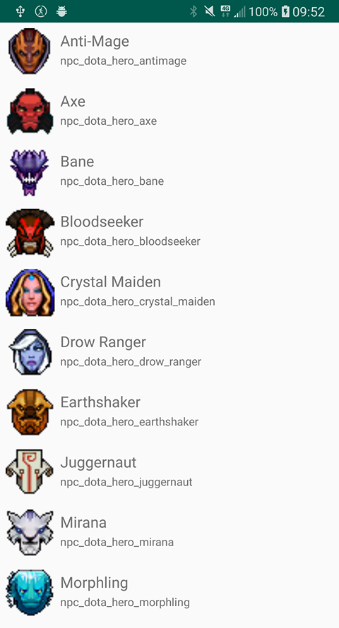
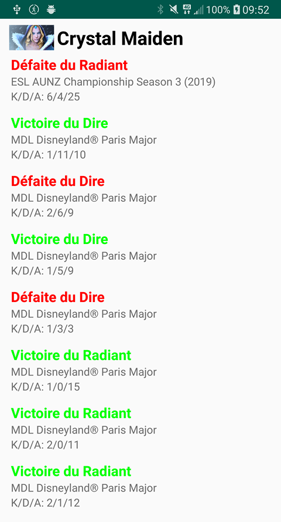

# Dota 2 Android App
This is and Android application using Java.
This application access tot the Dota 2 Api and get the Heroes list and show them. This application also provide information about the last matches of each hero.

## Getting Started
Download the apk in the repository and install it on your android phone.

## Activities
### Heroes List
A list of all Heroes in Dota 2.
When you click on one of them, the list of last Matches of this hero open.

### Matches List
A list of the last matches of an hero.

## Functionalities
* Gitflow
* MVC
* Recycler View
* Cache of data and image
* Image loading and access to a REST API

## Built With
* [Dota 2](https://docs.opendota.com/) - Dota 2 API
* [Glide](https://github.com/bumptech/glide) - To load and cache image
* [Retrofit](https://square.github.io/retrofit/) - To access to Rest API
* [ROOM](https://developer.android.com/training/data-storage/room/index.html) - To do caching

## Authors
* **Lucas Alias** - [Ekrynox](https://github.com/Ekrynox)
